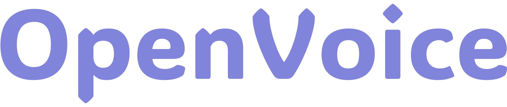
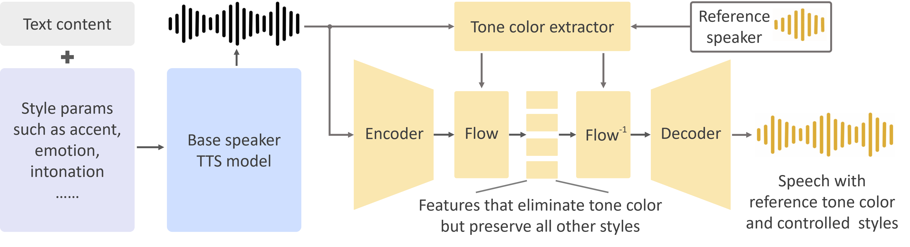

<div align="center">
  <div>&nbsp;</div>
  
  <div align="center">
    <font size="8">Versatile Instant Voice Cloning</font>
  </div>

[Paper](https://arxiv.org/abs/2312.01479) |
[Website](https://myshell-tts.vercel.app/) 

</div>

## Introduction
As we detailed in our [paper](https://arxiv.org/abs/2312.01479) and [website](https://myshell-tts.vercel.app/), the advantages of OpenVoice are three-fold:

**1. Accurate Tone Color Cloning.**
OpenVoice can accurately clone the reference tone color and generate speech in multiple languages and accents.

**2. Flexible Voice Style Control.**
OpenVoice enables granular control over voice styles, such as emotion and accent, as well as other style parameters including rhythm, pauses, and intonation. 

**3. Zero-shot Cross-lingual Voice Cloning.**
Neither of the language of the generated speech nor the language of the reference speech needs to be presented in the massive-speaker multi-lingual training dataset.

<div align="center">
  <div>&nbsp;</div>
    
  <div>&nbsp;</div>
</div>

OpenVoice has been powering the instant voice cloning capability of [MyShell.ai](https://myshell.ai/) (a decentralized and comprehensive platform for discovering, creating, and staking AI-native apps) since May 2023. Until Nov 2023, the voice cloning model has been used tens of millions of times by users worldwide, and witnessed the explosive user growth on the platform.

## Disclaimer

The released models are **half-performance** models, including the base speaker model and the tone color converter model. Once our concerns of the ethical issues such as misuse is cleared, we will release the full-performance models. The online version in MyShell.ai does not use this repository.

## Installation
Clone this repo, and run
```
conda create -n openvoice python=3.9
conda activate openvoice
conda install pytorch==1.13.1 torchvision==0.14.1 torchaudio==0.13.1 pytorch-cuda=11.7 -c pytorch -c nvidia
pip install -r requirements.txt
```
Download the checkpoint from here and extract it to the `checkpoints` folder 

## Usage

**1. Basic Usage.**
Please see `demo.ipynb` for a basic demo usage.

**2. Advanced Usage.**
The base speaker model can be replaced with any model (in any language and style) that the user prefer. With the tone color converter, the user is able to clone the reference voice and generate speech in any language and any style they desire, as long as they have the single-speaker base model. Please use the `se_extractor.get_se` function as demonstrated in `demo.ipynb` to extract the tone color embedding for the new base speaker.

**3. Tips to Generate Natural Speech.**
There are many single or multi-speaker TTS methods that can generate natural speech, and are readily available, such as the open-source VITS and closed-sourced OpenAI TTS. By simply replacing the base speaker model with the model you prefer, you can push the speech naturalness to a level you desire.

## Citation
```
@article{qin2023openvoice,
  title={OpenVoice: Versatile Instant Voice Cloning},
  author={Qin, Zengyi and Zhao, Wenliang and Yu, Xumin and Sun, Xin},
  journal={arXiv preprint arXiv:2312.01479},
  year={2023}
}
```

## License
This repository is licensed under a Creative Commons Attribution-NonCommercial 4.0 International License, which prohibits commercial usage.


## Acknowledgements
This open-source implementation is based on several open-source projects, [TTS](https://github.com/coqui-ai/TTS), [VITS](https://github.com/jaywalnut310/vits), and [VITS2](https://github.com/daniilrobnikov/vits2). Thanks for their awesome work!
