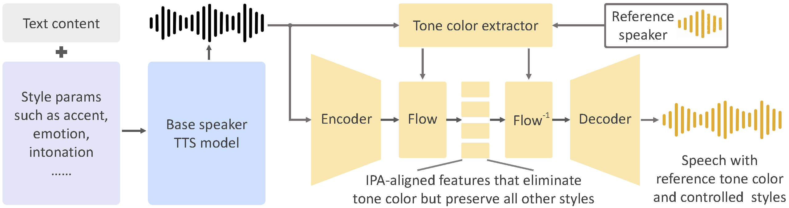

<div align="center">
  <div>&nbsp;</div>
   

[Paper](https://arxiv.org/abs/2312.01479) |
[Website](https://research.myshell.ai/open-voice) 

</div>

## Join Our Community

Join our [Discord community](https://discord.gg/myshell) and select the `Developer` role upon joining to gain exclusive access to our developer-only channel! Don't miss out on valuable discussions and collaboration opportunities.

## Introduction
As we detailed in our [paper](https://arxiv.org/abs/2312.01479) and [website](https://research.myshell.ai/open-voice), the advantages of OpenVoice are three-fold:

**1. Accurate Tone Color Cloning.**
OpenVoice can accurately clone the reference tone color and generate speech in multiple languages and accents.

**2. Flexible Voice Style Control.**
OpenVoice enables granular control over voice styles, such as emotion and accent, as well as other style parameters including rhythm, pauses, and intonation. 

**3. Zero-shot Cross-lingual Voice Cloning.**
Neither of the language of the generated speech nor the language of the reference speech needs to be presented in the massive-speaker multi-lingual training dataset.

[Video](https://github.com/myshell-ai/OpenVoice/assets/40556743/3cba936f-82bf-476c-9e52-09f0f417bb2f)

<div align="center">
  <div>&nbsp;</div>
    
  <div>&nbsp;</div>
</div>

OpenVoice has been powering the instant voice cloning capability of [myshell.ai](https://app.myshell.ai/explore) since May 2023. Until Nov 2023, the voice cloning model has been used tens of millions of times by users worldwide, and witnessed the explosive user growth on the platform.

## Main Contributors

- [Zengyi Qin](https://www.qinzy.tech) at MIT and MyShell
- [Wenliang Zhao](https://wl-zhao.github.io) at Tsinghua University
- [Xumin Yu](https://yuxumin.github.io) at Tsinghua University
- [Ethan Sun](https://twitter.com/ethan_myshell) at MyShell

## Live Demo

<div align="center">
    <a href="https://www.lepton.ai/playground/openvoice"></a>
    &nbsp;&nbsp;&nbsp;&nbsp;
    <a href="https://app.myshell.ai/bot/z6Bvua/1702636181"></a>
    &nbsp;&nbsp;&nbsp;&nbsp;
    <a href="https://huggingface.co/spaces/myshell-ai/OpenVoice"></a>
</div>

## Common Issues

Please see [QnA](QA.md) for common questions and answers. We will regularly update the question and answer list.

## Disclaimer

This is an implementation that approximates the performance of the internal voice clone technology of [myshell.ai](https://app.myshell.ai/explore). The online version in myshell.ai has better 1) audio quality, 2) voice cloning similarity, 3) speech naturalness and 4) computational efficiency.

## Installation
Clone this repo, and run
```
conda create -n openvoice python=3.9
conda activate openvoice
conda install pytorch==1.13.1 torchvision==0.14.1 torchaudio==0.13.1 pytorch-cuda=11.7 -c pytorch -c nvidia
pip install -r requirements.txt
```
Download the checkpoint from [here](https://myshell-public-repo-hosting.s3.amazonaws.com/checkpoints_1226.zip) and extract it to the `checkpoints` folder 

## Usage

**1. Flexible Voice Style Control.**
Please see [`demo_part1.ipynb`](demo_part1.ipynb) for an example usage of how OpenVoice enables flexible style control over the cloned voice.

**2. Cross-Lingual Voice Cloning.**
Please see [`demo_part2.ipynb`](demo_part2.ipynb) for an example for languages seen or unseen in the MSML training set.

**3. Gradio Demo.**. We provide a minimalist local gradio demo here. We strongly suggest the users to look into `demo_part1.ipynb`, `demo_part2.ipynb` and the [QnA](QA.md) if they run into issues with the gradio demo. Launch a local gradio demo with `python -m openvoice_app --share`.

**3. Advanced Usage.**
The base speaker model can be replaced with any model (in any language and style) that the user prefer. Please use the `se_extractor.get_se` function as demonstrated in the demo to extract the tone color embedding for the new base speaker.

**4. Tips to Generate Natural Speech.**
There are many single or multi-speaker TTS methods that can generate natural speech, and are readily available. By simply replacing the base speaker model with the model you prefer, you can push the speech naturalness to a level you desire.

## Roadmap

- [x] Inference code
- [x] Tone color converter model
- [x] Multi-style base speaker model
- [x] Multi-style and multi-lingual demo
- [x] Base speaker model in other languages
- [x] EN base speaker model with better naturalness


## Citation
```
@article{qin2023openvoice,
  title={OpenVoice: Versatile Instant Voice Cloning},
  author={Qin, Zengyi and Zhao, Wenliang and Yu, Xumin and Sun, Xin},
  journal={arXiv preprint arXiv:2312.01479},
  year={2023}
}
```

## License
This repository is licensed under a Creative Commons Attribution-NonCommercial 4.0 International License, which prohibits commercial usage. **MyShell reserves the ability to detect whether an audio is generated by OpenVoice**, no matter whether the watermark is added or not.


## Acknowledgements
This implementation is based on several excellent projects, [TTS](https://github.com/coqui-ai/TTS), [VITS](https://github.com/jaywalnut310/vits), and [VITS2](https://github.com/daniilrobnikov/vits2). Thanks for their awesome work!
