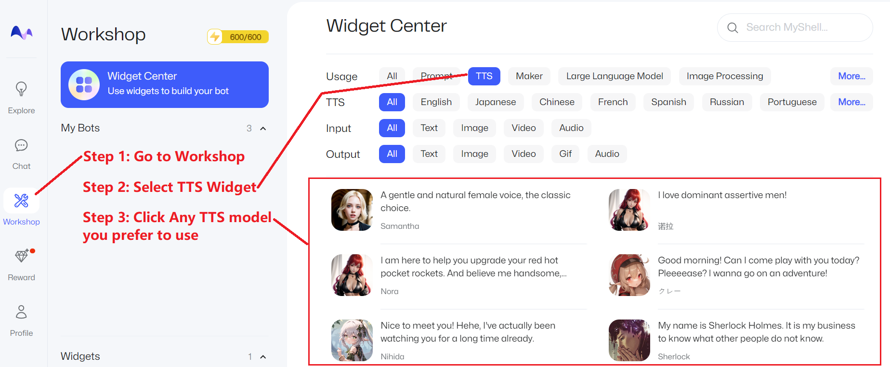
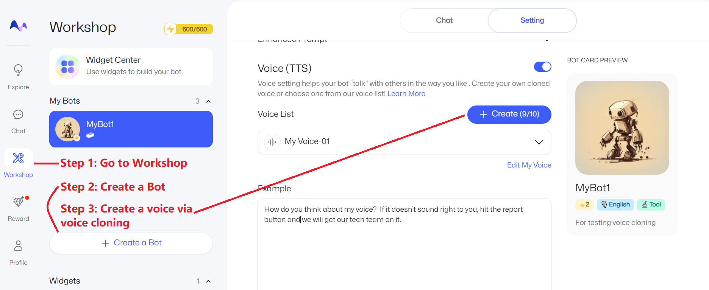

# Usage

## Table of Content

- [Use in MyShell](#use-in-myshell): directly use the Instant Voice Clone and TTS services.
- [Minimal Demo](#minimal-demo): quickly try OpenVoice and do not require high quality.
- [Linux Install](#linux-install): for researchers and developers only.
    - [V1](#openvoice-v1)
    - [V2](#openvoice-v2)

## Use in MyShell

For most users, the most convenient way is to directly use the free TTS and Instant Voice Clone services in MyShell.

### TTS

Go to [https://app.myshell.ai/explore](https://app.myshell.ai/explore) and follow the instructions below:

<div align="center">
   
</div>

### Voice Clone

Go to [https://app.myshell.ai/explore](https://app.myshell.ai/explore) and follow the instructions below:

<div align="center">
   
</div>

## Minimal Demo

For users who want to quickly try OpenVoice and do not require high quality or stability, click any of the following links:

<div align="center">
    <a href="https://www.lepton.ai/playground/openvoice"></a>
    &nbsp;&nbsp;&nbsp;&nbsp;
    <a href="https://app.myshell.ai/bot/z6Bvua/1702636181"></a>
    &nbsp;&nbsp;&nbsp;&nbsp;
    <a href="https://huggingface.co/spaces/myshell-ai/OpenVoice"></a>
</div>

## Linux Install

This section is only for developers and researchers who are familiar with Linux, Python and PyTorch. Clone this repo, and run

```
conda create -n openvoice python=3.9
conda activate openvoice
git clone git@github.com:myshell-ai/OpenVoice.git
cd OpenVoice
pip install -e .
```

No matter if you are using V1 or V2, the above installation is the same.

### OpenVoice V1

Download the checkpoint from [here](https://myshell-public-repo-hosting.s3.amazonaws.com/openvoice/checkpoints_1226.zip) and extract it to the `checkpoints` folder.

**1. Flexible Voice Style Control.**
Please see [`demo_part1.ipynb`](../demo_part1.ipynb) for an example usage of how OpenVoice enables flexible style control over the cloned voice.

**2. Cross-Lingual Voice Cloning.**
Please see [`demo_part2.ipynb`](../demo_part2.ipynb) for an example for languages seen or unseen in the MSML training set.

**3. Gradio Demo.**. We provide a minimalist local gradio demo here. We strongly suggest the users to look into `demo_part1.ipynb`, `demo_part2.ipynb` and the [QnA](QA.md) if they run into issues with the gradio demo. Launch a local gradio demo with `python -m openvoice_app --share`.

### OpenVoice V2

Download the checkpoint from [here](https://myshell-public-repo-hosting.s3.amazonaws.com/openvoice/checkpoints_v2_0417.zip) and extract it to the `checkpoints_v2` folder.

Install [MeloTTS](https://github.com/myshell-ai/MeloTTS):
```
pip install git+https://github.com/myshell-ai/MeloTTS.git
python -m unidic download
```

**Demo Usage.** Please see [`demo_part3.ipynb`](../demo_part3.ipynb) for example usage of OpenVoice V2. Now it natively supports English, Spanish, French, Chinese, Japanese and Korean.


## Windows Install (VS Code)

Please use [this guide](https://github.com/Alienpups/OpenVoice/blob/main/docs/USAGE_WINDOWS.md) if you want to install and use OpenVoice on Windows.
